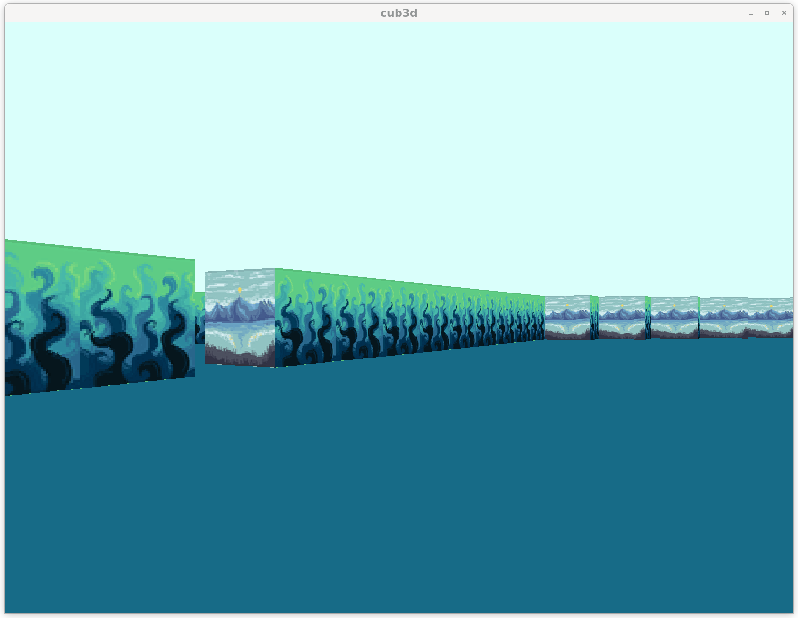
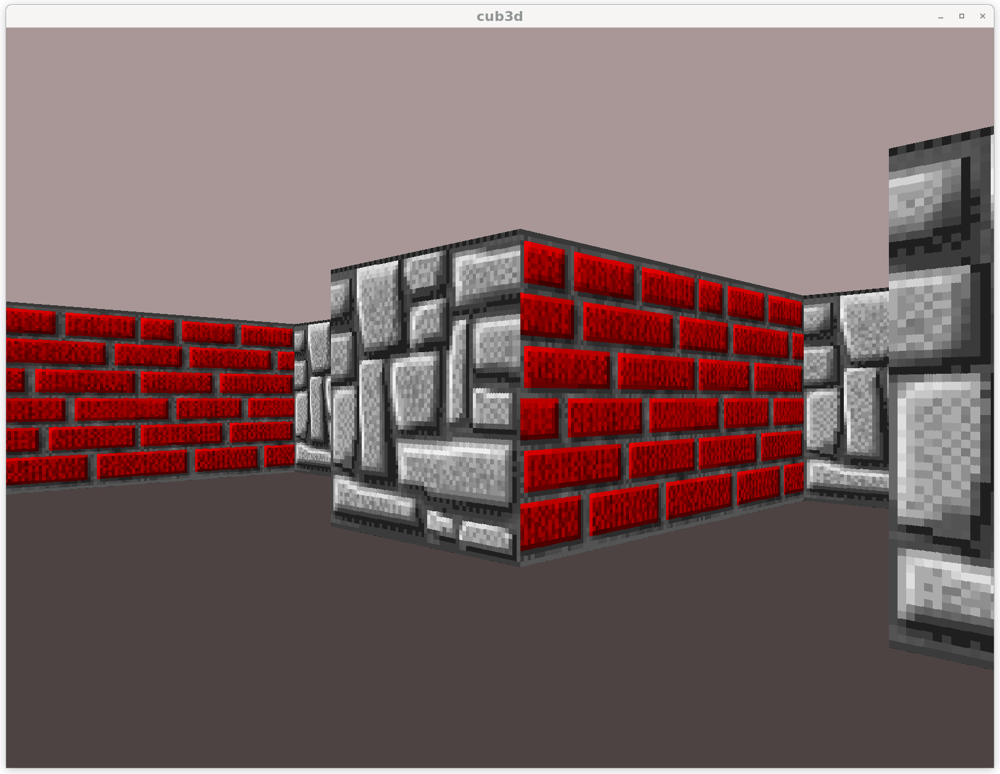
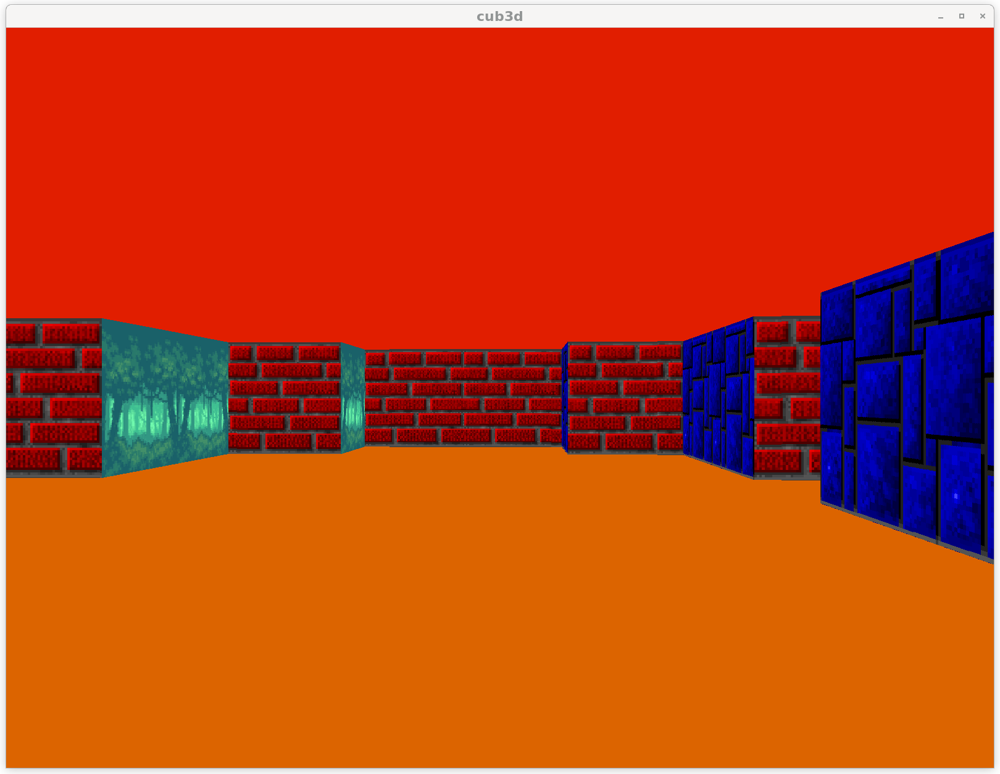

# cub3D
Raycasting gamedemo \
uses MLX42 https://github.com/codam-coding-college/MLX42 for window and texture management \
which is made by fellow codam student and based on https://github.com/glfw/glfw \
The full guidelines for the project can be found in `en.subject.pdf`.

## Usage
choose a map from the maps directory \
make
```bash
./cub3d maps/map_of_your_choice.ber
```
exit the game with `esc`, `ctrl-c in the terminal` or click the cross

you can change value in the maps \
these consist of the following elements:
- `C` : ceiling color in RGB value
- `F` : floor color in RGB value
- `NO` : texture for north facing wall
- `SO` : texture for south facing wall
- `EA` : texture for east facing wall
- `WE` : texture for west facing wall

## Screenshots of the game



